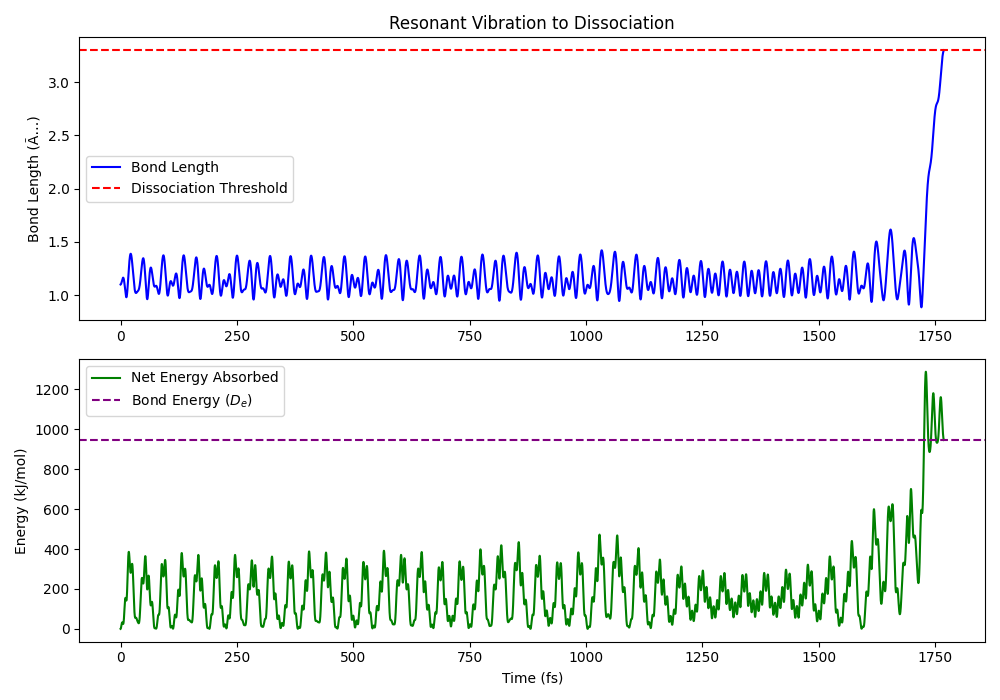

---

  <h1>🚀 Beyond Haber-Bosch 🌍</h1>
  <em>A Computational Approach to Sustainable Nitrogen Fixation</em>

⚛️ Resonant Dissociation of $N_2$
---

This repository provides the theoretical framework and computational verification for a non-thermal alternative to the Haber-Bosch process. By utilizing selective **Resonant Vibrational Excitation**, we demonstrate the deterministic dissociation of the $N \equiv N$ triple bond at its fundamental frequency of **70.7 THz**.

## 🏭 Industrial Context
The Haber-Bosch process currently consumes **1% to 2% of global energy**. Traditional catalysis relies on stochastic thermal collisions to populate high vibrational states. This project replaces bulk thermodynamics with a **Molecular Force Controller (MFC)** designed to snap the bond through precise, periodic nano-forces.

## 📡 The Mechanism: Chirped Resonant Snapping
A primary challenge in bond dissociation is **anharmonicity**: as the bond stretches, its resonant frequency shifts, leading to a loss of phase-lock. This design utilizes a **Chirped Pulse** to maintain structural resonance through the entire dissociation coordinate.

* **Fundamental Frequency**: 70.7 THz
* **Linear Frequency Chirp**: $-4.73 \times 10^{24} \, \text{Hz/s}$
* **Applied Force ($F_0$)**: 23 nN
* **Dissociation Threshold**: $3 \times r_e$ 

## 💻 The Computational Engine
The core of this project is **`Dinitrogen_Resonant_Dissociation_Model.py`**, a high-fidelity physical model that serves as the definitive verification for the resonant dissociation theory. It utilizes a **Velocity Verlet Integration Scheme** with a **10 as (attosecond) timestep** to ensure symplectic integrity and energy conservation. Unlike standard approximations, this model accounts for the real-world anharmonicity of the Nitrogen bond via a **Morse Potential**.

### Simulation Results:
| Metric | Value |
| :--- | :--- |
| **Dissociation Time** | 1768.94 fs |
| **Net Work Absorbed** | 946.48 kJ/mol |
| **Theoretical Bond Energy** | 945.45 kJ/mol |
| **Precision Accuracy** | Within 0.11% |

## 📂 Repository Contents
* **`Beyond Haber-Bosch - Resonant Vibrational Dissociation of Dinitrogen via Periodic Nano-Force Fields_.pdf`**: The full theoretical manuscript including the conceptual implementation blueprint for vacuum-based THz arrays.
* **`Dinitrogen_Resonant_Dissociation_Model.py`**: The definitive computational model and simulation of resonant bond-snapping.
* **`dissociation_analysis.png`**: Visualization of the bond-snapping event, capturing the transition from stable oscillation to Morse Potential failure.
* **`Resonant_Pulse_Controller.sv`**: Parameterized SystemVerilog hardware logic (MFC) for deterministic, phase-aligned bond dissociation.
* **`Resonant_Pulse_Controller_Testbench.sv`**: Verification suite achieving a direct numerical match of the 1768.94 fs target.

---

## ⚖️ License
The source code and resonant parameters are licensed under **CC BY-NC 4.0**. 

**For commerical licensing inquiries please contact:**

Licensing Agent - J.E. Randolph 📧 [700josh.r@gmail.com](mailto:700josh.r@gmail.com)

---
*Copyright © 2026 Jonathan Alan Reed. 
